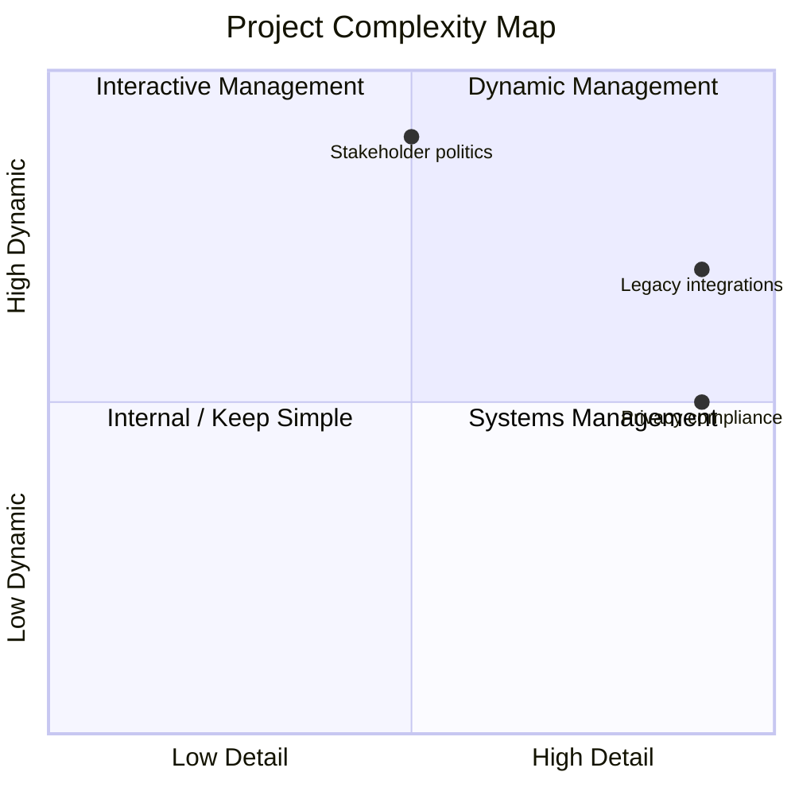

# Output Format

Use this report structure. Keep wording concise and evidence-based.

## Summary

Brief overview:

- Assessment mode: Fast Complexity Scan or Complete TOE Assessment.
- Overall confidence: High, Medium, or Low.
- Top 2-3 complexity hotspots.
- Overall management posture.

Example:

```md
### Summary

Fast Complexity Scan. Overall confidence: Medium.

Top hotspots: legacy integrations, stakeholder politics, and privacy compliance.
Overall posture: Dynamic management, because the project combines high detail
complexity with high dynamic complexity.
```

## Findings by Category

For each TOE category with findings, use this table.

```md
### Findings by Category

**Technical Complexity**

| Severity | Element | Score | Detail/Dynamic | Issue | Suggestion |
|----------|---------|------:|----------------|-------|------------|
| High | Integration with legacy systems | 5 | Detail 5 / Dynamic 4 | Many interfaces plus shifting departmental priorities can block downstream work | Use interface register, API prototypes, and joint integration reviews |

**Organizational Complexity**

| Severity | Element | Score | Detail/Dynamic | Issue | Suggestion |
|----------|---------|------:|----------------|-------|------------|

**External Complexity**

| Severity | Element | Score | Detail/Dynamic | Issue | Suggestion |
|----------|---------|------:|----------------|-------|------------|
```

Only include categories that have findings. In fast scan mode, include the most
relevant findings rather than every possible element.

## Quadrant Matrix

Always include this matrix.

```md
### Quadrant Matrix

| Detail Complexity | Dynamic Complexity | Quadrant | Management Fit | Main Risk |
|---|---|---|---|---|
| Low | Low | Simple / Internal | Keep simple | Over-managing |
| High | Low | Complicated | Systems management / control | Rigidity |
| Low | High | Complex | Interactive management / connecting | Endless discussion |
| High | High | Complex + complicated | Dynamic management | Poor balance between control and interaction |
```

## Overall Quadrant

Include one overall project classification. Do not hide hotspot variation.

```md
### Overall Quadrant

| Project | Detail | Dynamic | Overall Fit | Why |
|---|---:|---:|---|---|
| Smart city app | 4 | 4 | Dynamic management | Many integrations plus shifting stakeholders and compliance constraints |
```

## Hotspot Quadrants

Classify each major hotspot separately.

```md
### Hotspot Quadrants

| Element | TOE | Detail | Dynamic | Quadrant | Management Fit |
|---|---|---:|---:|---|---|
| Legacy integrations | T/O | 5 | 4 | Complex + complicated | Dynamic management |
| Privacy compliance | T/E | 5 | 3 | Complicated, leaning dynamic | Systems management plus connecting |
| Stakeholder politics | O/E | 3 | 5 | Complex | Interactive management with control gates |
```

## Complexity Map

Include a Mermaid quadrant chart for the top hotspots.

Use normalized values from 0.0 to 1.0:

- Detail 1 -> 0.10
- Detail 2 -> 0.30
- Detail 3 -> 0.50
- Detail 4 -> 0.70
- Detail 5 -> 0.90
- Dynamic uses the same mapping.



If Mermaid is unsuitable for the user context, use an ASCII 2x2 matrix instead.

## Management Fit

Recommend management approach per hotspot. Include control and connecting only
where relevant. Do not turn this into an action plan.

```md
### Management Fit

| Element | Best Fit | Control Intervention | Connecting Intervention | Value Opportunity |
|---|---|---|---|---|
| Legacy integrations | Dynamic management | Interface register and design gates | Joint API prototyping workshops | Reusable adapters reduce future service cost |
| Stakeholder politics | Interactive management with control gates | Steering committee owns scope decisions | Early alignment and transparent tradeoff sessions | Stakeholder support can increase adoption |
```

## Handoff

End with a human-readable handoff table. This is not an action plan.

```md
### Handoff

| Priority | Element | TOE | Severity | Quadrant | Recommended Fit |
|---|---|---|---|---|---|
| 1 | Legacy integrations | T/O | High | Complex + complicated | Dynamic management |
| 2 | Stakeholder politics | O/E | High | Complex | Interactive management with control gates |
```

## Do Not Include

- Action plan
- Stakeholder questions
- "What's Already Strong" section
- Machine-readable block
- JSON/YAML mode
